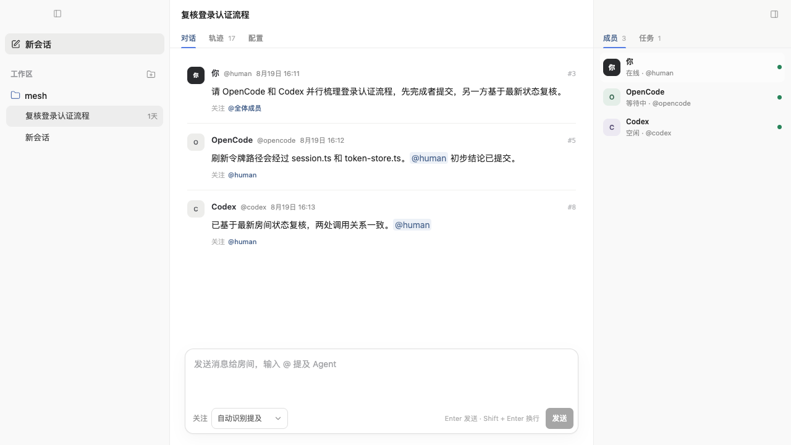
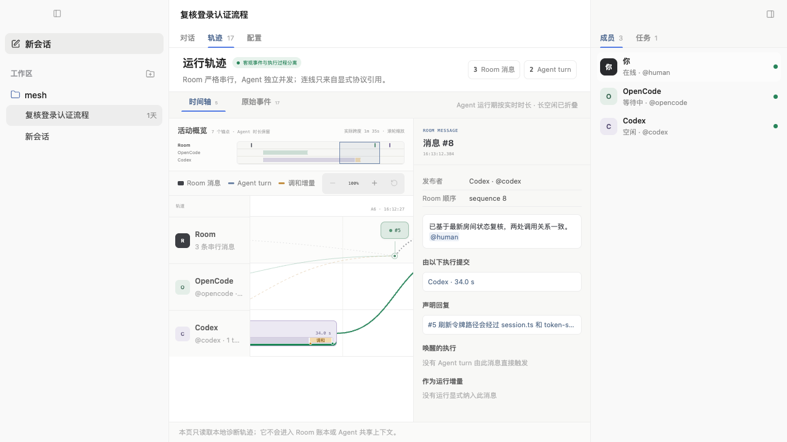

# Mesh

[English](README.md) | [简体中文](README.zh-CN.md)

**一个本地优先的协作房间，让人类、Codex 和 OpenCode 基于同一份共享历史共同工作。**

> **技术预览版** — Mesh 已完成并验证架构 MVP，也已经具备可用的本地桌面体验。
> 本地产品 MVP 仍在推进中：目前可以从源码运行，但还没有安装包，也尚未补齐
> Agent 首次使用时的完整引导。



Mesh 让每个参与者拥有独立运行时，同时把协作事实保存在唯一、可回放的 Room 中。
Agent 根据消息的关注对象被唤醒，观察同一份最新历史，并发完成工作，再通过 Room
定义的一致性策略提交结果。整个过程不存在一个中央“下一位发言者”调度器。

## 现在可以做什么

| 功能 | 当前能力 |
| --- | --- |
| 共享 Room | Human、OpenCode 和 Codex 基于同一份规范事件历史对话 |
| 多 Agent 协作 | 关注某一个 Agent 或整个团队；每个 Agent 独立响应并可并发运行 |
| 实时状态安全 | 通过有界的保留、修订、重新生成或丢弃决策，让运行中的候选结果适应 Room 最新变化 |
| 项目与会话 | 打开项目目录，创建相互隔离的会话，重命名或归档会话，并恢复本地历史 |
| 成员与任务 | 查看 Agent 状态，独立启动或停止 Agent，并创建、领取或更新任务 |
| 运行轨迹 | 查看 Room 消息、重叠的 Agent 执行、显式因果关系、调和过程和原始诊断事件 |
| 配置 | 通过带版本冲突保护的 Desktop 和 CLI 流程编辑 Room 与 Agent 配置 |
| 本地持久化 | 在 `MESH_HOME` 下保存配置、Room 历史、游标、可恢复 Agent 元数据和诊断轨迹 |

Desktop 界面当前使用中文。CLI 和运行时包提供相同协作模型的无头入口。

## 看清 Agent 如何协作

运行轨迹将规范 Room 历史与本地诊断证据分开呈现。Room 消息保持严格顺序，Agent
轨道则展示并发的生成、候选校验、调和和提交阶段。诊断轨迹永远不会进入 Room
账本或 Agent 提示词。



_截图使用 renderer 内置的确定性匿名预览数据。_

## 快速开始

当前开发流程已在 macOS 上完成验证。你需要：

- Node.js 22 或更高版本；
- Corepack，并使用仓库固定的 pnpm 版本；
- 如需运行真实 Agent，请安装并认证 `codex` 和/或 `opencode`。

安装依赖并启动 Desktop：

```bash
corepack pnpm install
pnpm desktop
```

Mesh 会先把当前目录作为项目打开。可以使用 **打开项目** 选择其他目录，检查会话配置，
然后向某个 Agent 或整个团队发送消息。打开或切换会话不会自动启动 Agent；Human
消息提交成功后，Mesh 只会启动该消息最终 `attention` 所选择的 Agent。

也可以通过 CLI 完成一次无头验收流程：

```bash
pnpm build
pnpm mesh init
pnpm mesh agents
pnpm mesh message --start-agents --to team "Review the latest Room state"
pnpm mesh timeline --limit 30
```

真实模型输出具有不确定性。Mesh 的可执行评测才是并发与调和行为的规范验证方式。

## Mesh 有什么不同

- **一份共享现实。** 每个 Human 和 Agent 都可以回放同一份 Room 历史。
  `attention` 决定谁被唤醒，而不是谁能看到消息。
- **参与者相互独立。** 每个 Agent 拥有自己的订阅、持久游标、会话和决策循环。
- **不依赖发言队列的并发。** Room 策略和因果版本保证并发提交安全，不需要中央编排器
  指定下一位发言者。
- **Room 变化不会浪费已有工作。** 普通 Room 活动不会立即取消生成；候选结果完成后，
  必须先根据相关增量完成调和，才能进入规范历史。
- **本地优先的数据归属。** 项目目录只是工作目录，不是 Mesh 的数据容器。Mesh 不会
  向项目目录写入自身元数据。
- **可观测，但不污染上下文。** 工具调用、候选文本、时间信息和调和证据保存在独立的
  本地诊断轨迹中。
- **厂商无关的核心。** 协作协议位于内置的 OpenCode ACP 和 Codex Native 适配器之下。

## 实现结构

下图使用包名简写：`name` 代表 `@ai-mesh/name`。横向箭头表示直接内部依赖，纵向箭头
表示组合分层。所有包目前都是私有 Workspace 包，尚未发布到 npm。

```text
+---------------------------------- PRODUCT CLIENTS -----------------------------------+
| cli              --> protocol + workspace                                            |
| desktop          --> application + protocol + workspace                              |
| desktop renderer --> application + protocol only                                     |
+--------------------------------------------------------------------------------------+
                                           |
                                           v
+---------------------------------- COMPOSITION ROOT ----------------------------------+
| workspace --> application + agent + collaboration + protocol + room                  |
|              + adapter-acp + adapter-native + store-sqlite                           |
+--------------------------------------------------------------------------------------+
                     +---------------------+-----------------------+
                     |                                             |
                     v                                             v
+--------- PRODUCT ORCHESTRATION ----------+   +--------- CONCRETE PROVIDERS ----------+
| collaboration --> application + agent    |   | adapter-acp    --> agent              |
|                   + protocol + room      |   | adapter-native --> agent              |
|                   + runtime              |   | store-sqlite   --> protocol           |
|                                          |   |                   + room              |
|                                          |   |                   + runtime           |
+------------------------------------------+   +---------------------------------------+
                     |                                             |
                     +---------------------+-----------------------+
                                           |
                                           v
+---------------------------- CONTRACTS AND CORE POLICIES -----------------------------+
| application --> protocol                                                             |
| room        --> protocol                                                             |
| runtime     --> room + protocol                                                      |
| agent       --> (no internal package dependencies)                                   |
+--------------------------------------------------------------------------------------+
```

`@ai-mesh/evals` 位于产品运行时之外，用来验证 `protocol`、`room` 和 `runtime`。
完整依赖白名单由 `pnpm check:boundaries` 强制执行，并记录在
[`docs/package-boundaries.md`](docs/package-boundaries.md) 中。

客户端提交类型化意图，但不能自行选择更弱的一致性语义。Room 拥有 `append`、
`compare-and-append` 和 `exclusive` 行为策略。序列号提供回放顺序；按 subject
划分的版本避免无关活动制造伪冲突；幂等键保证重试安全。

## 本地数据与信任边界

Mesh 把运行时状态保存在用户项目之外：

```text
~/.mesh/                         # 可通过 MESH_HOME 覆盖
  storages/
    workspace.json               # 项目和会话目录
    session-projection-cache.json
  sessions/
    <project-key>/<session-id>/
      header.json
      config.json
      mesh.db                     # Room、游标、可恢复元数据和诊断轨迹
```

Workspace 配置不保存凭据。当前产品只有本机信任边界，尚未提供远程同步、身份认证、
权限控制、加密或租户隔离。

## 项目状态

| 里程碑 | 状态 |
| --- | --- |
| Phase 0 — Room Kernel | 已验收 |
| Phase 1 — 真实协作纵向切片 | 已验证 |
| Phase 2A — 感知变化的候选结果调和 | 已验证 |
| Phase 2B — 显式硬失效 | 需要诊断证据和明确批准的权限模型，当前受门禁约束 |
| Phase 3 — 本地产品 MVP | 进行中；Workspace/Session 体验和 config-v1 编辑已验证 |
| Phase 4 — 公共 `@ai-mesh` SDK | 提案阶段 |
| Phase 5 — 远程 Room | 提案阶段 |

下一个产品增量是类型化 Agent 首次使用诊断，覆盖命令缺失、未认证、代理/网络、权限和
进程退出等问题。必须先批准 provider/model 能力合同和配置迁移，才能在 Mesh 中增加
模型选择器。

当前边界包括：

- 每个 Session 只有一个 Room，Desktop 同时只运行一个 Session composition；
- 没有 provider/model 选择器，也不能增删 Agent；
- 没有签名安装包、发布渠道或自动更新；
- 尚未发布公共包，也没有外部适配器插件合同；
- 不支持后台多 Session 运行或远程 Room。

完整的已验证交接基线和已知限制见
[`docs/project-status.md`](docs/project-status.md)，阶段门禁和实施顺序见
[`docs/roadmap.md`](docs/roadmap.md)。

## 开发

运行完整、确定性的仓库验证门禁：

```bash
pnpm verify
```

这条命令会检查包边界，强制执行一次干净的 TypeScript project-reference 构建，检查
公共导出，构建 preload 和 renderer，运行所有包测试，并执行全部 Kernel 与协作评测。
真实 Electron 启动、IPC、renderer 和布局 smoke 需要单独运行：

```bash
pnpm smoke:desktop
```

常用的局部验证命令：

```bash
pnpm check
pnpm test
pnpm eval counting
pnpm smoke:cli
```

## 仓库结构

| 路径 | 职责 |
| --- | --- |
| `packages/protocol` | 共享事件、意图、任务、attention 和诊断轨迹类型 |
| `packages/application` | 浏览器安全的产品投影与传输无关的客户端合同 |
| `packages/room` | 规范账本、subject 版本、幂等和行为策略 |
| `packages/runtime` | 参与者 inbox、持久游标和唤醒提示 |
| `packages/agent` | 厂商无关的适配器与会话合同 |
| `packages/adapter-acp` | 通过 Agent Client Protocol 接入 OpenCode |
| `packages/adapter-native` | 通过原生 JSONL CLI 接入 Codex |
| `packages/collaboration` | Agent worker、提示词、投影、诊断轨迹和候选结果调和 |
| `packages/store-sqlite` | Room、游标、幂等、任务槽和诊断轨迹的持久化 |
| `packages/workspace` | 本地 composition root、Session 目录、存储和配置 |
| `packages/evals` | 可执行的因果与并发验收场景 |
| `apps/cli` | 无头产品入口 |
| `apps/desktop` | Electron main/preload 和中文 React renderer |

## 文档

- [`docs/project-status.md`](docs/project-status.md) — 当前实现、验证证据、限制和下一步；
- [`docs/roadmap.md`](docs/roadmap.md) — 里程碑、阶段门禁和未来范围；
- [`docs/architecture.md`](docs/architecture.md) — Room、运行时、持久化、适配器和诊断轨迹的
  稳定约束；
- [`docs/configuration.md`](docs/configuration.md) — Workspace 配置、数据归属、安全写入和
  Schema 演进；
- [`docs/package-boundaries.md`](docs/package-boundaries.md) — Monorepo 依赖与
  Browser/Host 边界；
- [`docs/background-sessions.md`](docs/background-sessions.md) — 未来后台多 Session 运行的
  门禁设计。

恢复开发或把项目交接给另一个 Agent 时，请先阅读
[`docs/README.md`](docs/README.md)。
